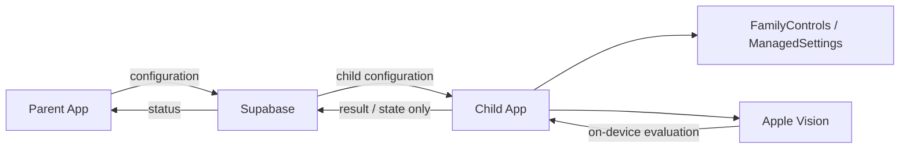

# NotBrainRot

**NotBrainRot** is an iOS parental-control project that connects selected Screen Time access with short physical exercises.

The project consists of separate **Parent** and **Child** apps. Instead of monitoring what a child watches, the goal is to create a simple intervention: complete an exercise, verify it on-device, and continue using the selected app.

> This repository is an information-only project showcase.  
> The production source code is private because NotBrainRot is actively developed as a proprietary product.

## Why this project exists

Screen-time tools are usually built around blocking, monitoring, or fixed time limits. NotBrainRot explores a different approach: linking continued access to a small amount of physical activity.

The project is designed around three principles:

- **Privacy by design** — exercise video is evaluated on-device and is not uploaded for remote viewing.
- **Minimal surveillance** — parents configure access rules, but do not receive watched-content histories.
- **Practical friction** — the intervention should be short enough to use in everyday family life, while still interrupting passive scrolling.

## What we built

NotBrainRot is an end-to-end product project covering iOS development, backend integration, device policy APIs, computer vision, and release engineering.

### Parent / Child flow

- Separate Parent and Child iOS apps
- Device pairing and configuration flow
- Parent-managed app selections and exercise requirements
- Screen Time shielding through Apple Family Controls APIs
- Child-side exercise flow before selected apps become available again

### On-device exercise evaluation

Exercise repetitions and basic form are evaluated locally using Apple's Vision framework.

Current work includes evaluators for movements such as:

- Squats
- High knees
- Chain punches
- Push-up and additional exercise evaluators in development

The goal is not medical-grade motion analysis. The system focuses on practical rep counting, form checks, and simple anti-cheat signals suitable for a mobile-device workflow.

### Backend

Supabase is used for the coordination layer between Parent and Child devices, including:

- parent / child relationships
- device pairing
- child configuration
- connection-state handling
- release-related backend services

The backend stores coordination and result data rather than exercise video.

## High-level architecture

The architecture deliberately keeps exercise-video processing on the device.

## Technical areas

**iOS**

- Swift
- SwiftUI
- FamilyControls
- ManagedSettings
- DeviceActivity
- Vision
- App Groups
- APNs
- StoreKit / subscription integration work

**Backend**

- Supabase
- PostgreSQL
- Edge Functions
- device pairing and configuration logic

**Engineering / release**

- Apple Developer Organization account
- Family Controls entitlement
- code signing and provisioning
- TestFlight preparation
- App Store release planning

## Engineering challenges

Some of the most interesting parts of the project are not visible in a simple UI screenshot:

- reliably coordinating Parent and Child devices without turning the product into a surveillance system
- working within Apple's Screen Time entitlement and authorization model
- designing exercise evaluators that distinguish valid repetitions from partial or incorrect movement
- keeping pose analysis local while still communicating enough state for the Parent app
- handling app shielding and recovery states when permissions or device configuration change
- preparing two related apps for TestFlight and App Store distribution

## Current status

The core Parent/Child prototype and pairing flow are functional. Screen Time configuration and multiple exercise evaluators have been implemented and tested. Current work focuses on evaluator quality, release preparation, subscription/backend integration, and final product polish.

## Repository scope

This repository intentionally contains **documentation only**.

It does **not** contain:

- production source code
- signing material or secrets
- Supabase credentials
- internal API keys
- entitlement files
- private backend implementation details

The purpose of this repository is to provide a technical overview of the project without publishing proprietary implementation code.
