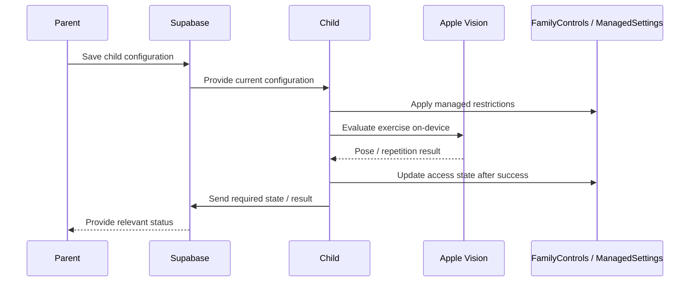

# Architecture Overview

This document describes the architecture of NotBrainRot at a deliberately high level.

## Components

### Parent App

The Parent app is responsible for configuration and supervision of the child-device setup.

Responsibilities include:

- pairing a child device
- selecting apps that should be managed
- assigning exercise requirements
- receiving health / connection state where appropriate
- managing subscription-related access

### Child App

The Child app applies the configuration received for that device.

Responsibilities include:

- applying Screen Time restrictions
- presenting the exercise flow
- running pose evaluation on-device
- restoring access after successful completion
- reporting only the state required for coordination

### Supabase

Supabase provides the coordination layer between devices.

It is used for:

- device registration
- parent / child relationships
- pairing
- child configuration
- state synchronization
- selected backend services

### Apple frameworks

NotBrainRot relies on several Apple frameworks because Screen Time enforcement and exercise evaluation both need to remain native to iOS.

Relevant areas include:

- FamilyControls
- ManagedSettings
- DeviceActivity
- Vision
- App Groups
- APNs

## Data-flow principle

The central privacy decision is that exercise-video analysis happens locally on the Child device.

The backend is not designed as a remote video-processing service.

## Design goals

The architecture aims to keep the system:

- privacy-conscious
- understandable for parents and children
- resilient to permission and connection-state changes
- compatible with Apple's Screen Time model
- modular enough to add further exercise evaluators without redesigning the core product

## What is intentionally omitted

This public documentation does not describe:

- database credentials
- production schemas in full
- private endpoint implementation
- signing or entitlement assets
- anti-abuse thresholds
- detailed pose-evaluation heuristics
- proprietary application source code

Those details remain in the private development repository.
